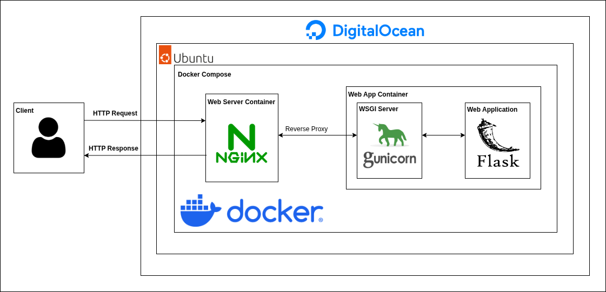

# MBTI Predictor Web App


Activate the environment  
```
. .venv/bin/activate
```

## Inspiration
- [Deploying a Flask To-Do App with Docker, Nginx, and MySQL](https://netopsautomation.medium.com/deploying-a-flask-to-do-app-with-docker-nginx-and-mysql-4b85a7e929a3)  
- [How To Serve Flask Applications with Gunicorn and Nginx on Ubuntu 22.04](https://www.digitalocean.com/community/tutorials/how-to-serve-flask-applications-with-gunicorn-and-nginx-on-ubuntu-22-04)  
